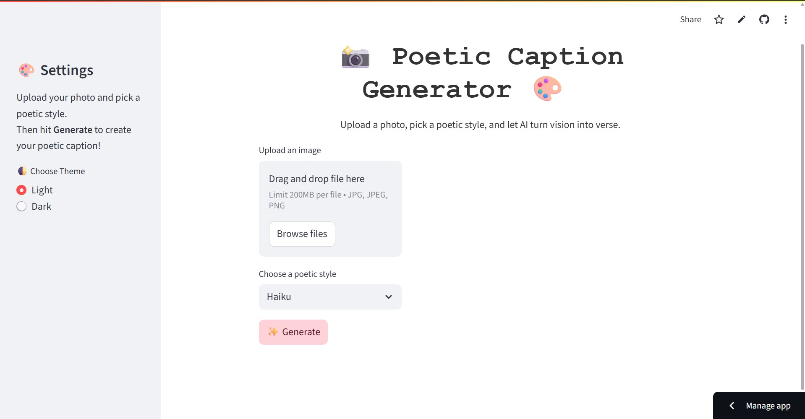
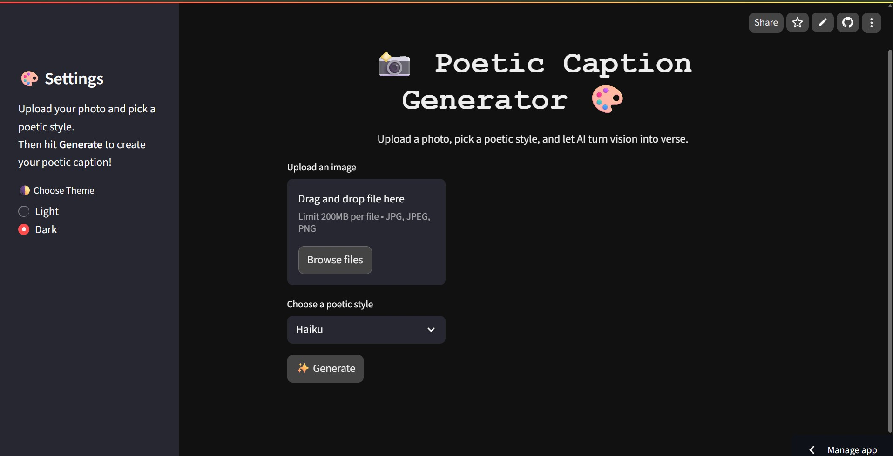
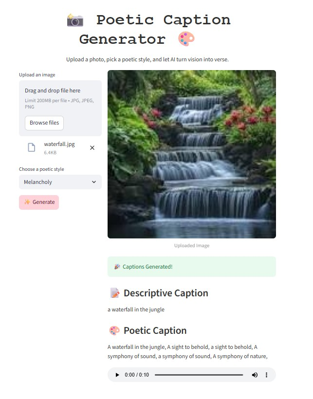

# Poetic Caption Generator (Streamlit App) 🎨📸

A Streamlit web app that uses AI models to generate **poetic captions** from images!  
Upload a photo, select a poetic style, and get a beautiful descriptive caption and poem — complete with voice narration.

---

## Features

- Image captioning using [BLIP](https://huggingface.co/Salesforce/blip-image-captioning-base)
- Poetic caption generation in various styles (Romantic, Haiku, Funny, Shakespearean, Melancholy)
- Voice narration of generated poetic captions with `gTTS`
- Light/Dark mode toggle with custom UI colors
- Clean, responsive UI built with Streamlit

---

## Installation

1. Clone this repository:
   ```bash
   git clone https://github.com/varnika3105/poetic-caption-streamlit.git
   cd poetic-caption-streamlit
2. Create and activate a Python virtual environment (recommended):
   ```bash
   python -m venv venv
   source venv/bin/activate # Linux/Mac
   venv\Scripts\activate # Windows
3. Install dependencies:
   ```bash
   pip install -r requirements.txt

---

## Usage

Run the app locally with:
  ```bash
  streamlit run app.py

Then open the URL shown in your browser (usually http://localhost:8501).
```
---

## Poetic Styles Supported

- Romantic
- Haiku
- Funny
- Shakespearean
- Melancholy

---

## Requirements

- Python 3.8+
- streamlit
- torch
- transformers
- Pillow
- gtts

---

## Screenshots





---

## Contributing

Feel free to open issues or submit pull requests to improve the app!

---

## License

[MIT License](LICENSE)

---

## Contact

Created by Varnika Khokhar  
[GitHub Profile](https://github.com/varnika3105)


---

## Contact

Created by Varnika Khokhar  
[GitHub Profile](https://github.com/varnika3105)
